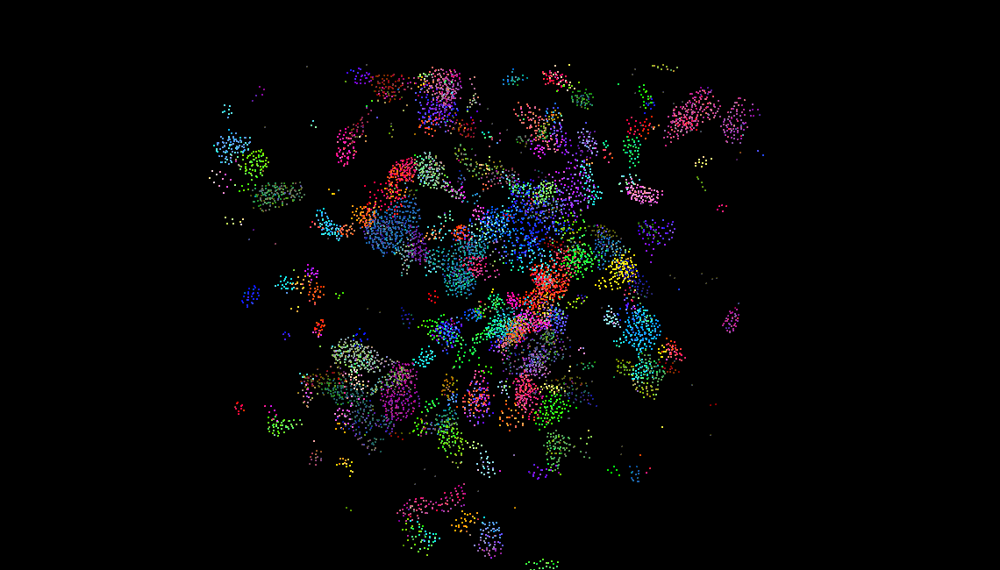

**University of Pennsylvania, CIS 5650: GPU Programming and Architecture,
Project 1 - Flocking**

* Grace Tan
* Tested on: Windows 11 Home 25H2 (Build 26200), AMD Ryzen 9 8945HX @ 2.50GHz, 16GB RAM, NVIDIA GeForce RTX 5060 Laptop GPU 8GB

### Project 1: CUDA Boids Simulation 

